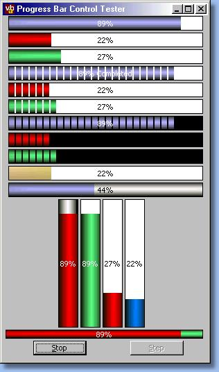



## Cool ProgressBar

### Description

You will love it!

The Best Progress Bar even created, very nice and powerfull.

Less than perfect. ;-)

3D look, Gold, image backgrounds... and plus.

Created by Steve McMahon f rom VBAccelerator.

With images and form implementation by me - José Luis Farías

JoseloFarias[at]adinet.com.uy

Desde Uruguay.

Please, if you use in your own proyects, please sendme a program copy (source code if better)
 
### More Info
 

             |
---                |---
**Submitted On**   |2003-07-30 11:33:20
**By**             |[José Luis Farías](https://github.com/Planet-Source-Code/PSCIndex/blob/master/ByAuthor/jos-luis-far-as.md)
**Level**          |Intermediate
**User Rating**    |5.0 (30 globes from 6 users)
**Compatibility**  |VB 5\.0, VB 6\.0
**Category**       |[Custom Controls/ Forms/  Menus](https://github.com/Planet-Source-Code/PSCIndex/blob/master/ByCategory/custom-controls-forms-menus__1-4.md)
**World**          |[Visual Basic](https://github.com/Planet-Source-Code/PSCIndex/blob/master/ByWorld/visual-basic.md)
**Archive File**   |[Cool\_Progr162293812003\.zip](https://github.com/Planet-Source-Code/jos-luis-far-as-cool-progressbar__1-47326/archive/master.zip)

